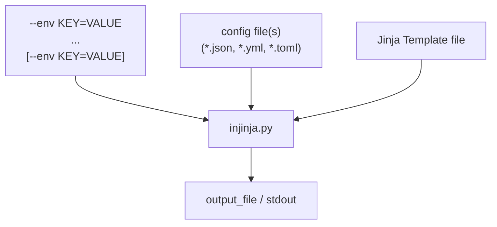
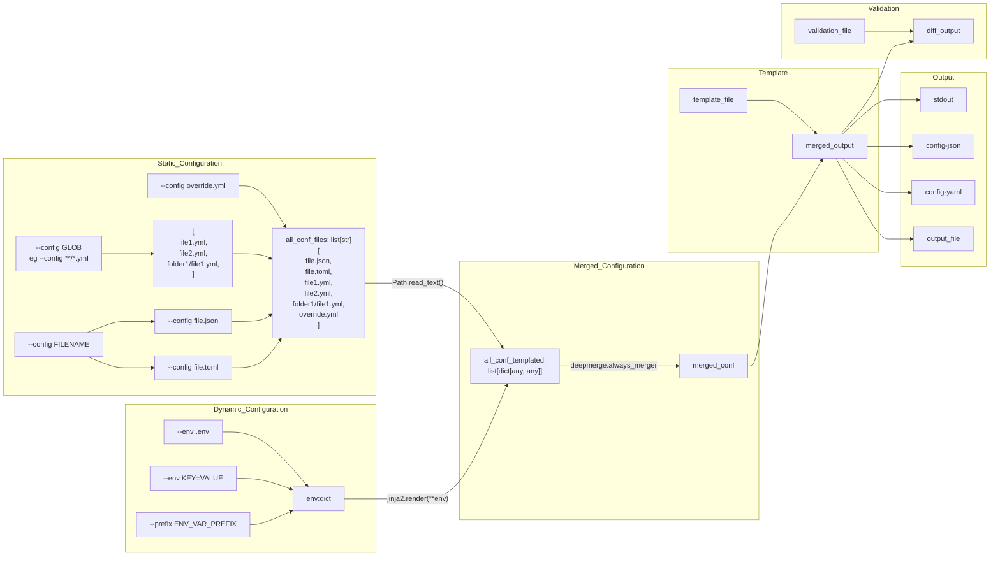
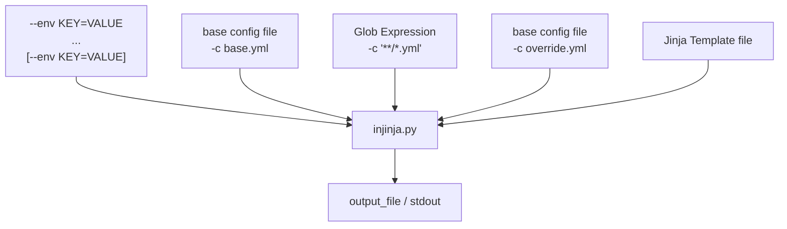
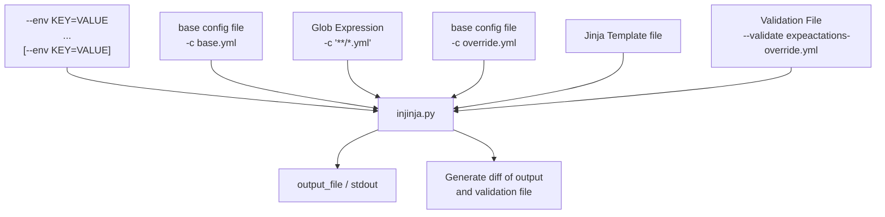

# injinja 🥷

Injinja: **Inj**ectable **Jinja** Configuration tool. 

_Insanely configurable... config system._

<!--TOC-->

- [injinja 🥷](#injinja-)
- [Quickstart](#quickstart)
  - [Overview](#overview)
  - [Usage](#usage)
  - [Architecture](#architecture)
  - [Advanced - Collections of config files](#advanced---collections-of-config-files)
  - [Testing](#testing)
  - [Debugging](#debugging)
  - [TODO](#todo)

<!--TOC-->

# Quickstart

```sh
uv run injinja.py -t samples/templates/template.yml -c 'samples/config/*' -e home_dir="$HOME"
```

## Overview

Inspired by my prior work [invoke_databricks_wheel_tasks](https://github.com/neozenith/invoke-databricks-wheel-tasks/blob/main/invoke_databricks_wheel_tasks/tasks.py#L81) and also a style of platform engineering I am seeing which is _configuration driven platform components_.

This setup allows for configuration driven code based akin to Kubernetes, dbt etc with what I like to called `Folders of Config`.

- Split up `One Big Fat YAML` into many smaller sensible `.yml` files
- Organise your `yml` config into hierarchical folders.
- Just like `dbt` assume every config file is `jinja` templated first
- Magically they are all `RecursivelyDeepMerge`d at runtime so it is like they were always `One Big Fat YAML`.

*_All of the above also works with `json` and `toml` and mixing them_. You're welcome! 🦾

Oh yeah, and then apply this ultra flexible config to your target jinja template output file.




1. Literally **ANY** config schema in a file format YML, JSON or TOML can be treated as a _Jinja2 Template itself_.
    - This makes for **VERY** dynamic config.
1. Then that config **IS** the config provided for a target Jinja template.
1. This final template could be terraform, SQL, js, python or even more JSON or YAML.

Output defaults to `stdout` or an output file can be specified.

This allows some "ahead-of-time config" and some "just-in-time config" to all be injected into a final output.
Absence of the "just-in-time" config results in merely merging the config file into the template.

Templating variables and not providing a value will throw an error to ensure templating is correct at runtime.

## Usage

```sh
pip install https://github.com/neozenith/injinja/archive/main.zip
```

```sh
USAGE: uv run injinja.py [--debug] [--template/-t TEMPLATE]  [--config/-c CONFIGFILE/GLOB] [--config/-c CONFIGFILE/GLOB] [--env KEY=VALUE] [--env KEY=VALUE] [--output OUTPUTFILE] [--validate/-v VALIDATION_FILE]
```

One liner:

```sh
curl -fsSL https://raw.githubusercontent.com/neozenith/injinja/refs/heads/main/src/injinja/injinja.py | sh -c "python3 - -t template.j2 -c config.yml -e home_dir=$HOME"
```

## Architecture





## Advanced - Collections of config files



- Firstly the `--env` flags are collected and turned into a `dict`
- Next the `--config/-c` flags are collected
    - If the value passes the `pathlib.Path(c).is_file()` check then it is used as-is.
    - If it fails the above check then it is attempted to be expanded using `glob.glob(c)`
    - The order of the `-c` flags allow re-specifying the same file again as the last file to ensure it is an override file.
- This list of configs are each independently templated with the `dict` from `--env`
- They then use `deepmerge.always_merger` to iteratively layer the config to make a final config. (Hence the importance of the ordering of flags.)

## Testing



For the sake of some testing, adding the flag for a fixed text output allows the use of `difflib` to generate a text diff for sanity checking output from an expectation.

## Debugging

### Export Merged Config

Addded the `--output` options of either `config-json` or `config-yaml` / `config-yml`, which will actually output the merged config to `stdout`. This can then be filtered and triaged using tools like `jq` or `yq`.

### Stream Config from `stdin`

Added the `--stdin-format json` and `--stdin-format yml` so that we can stream input that is potentially the output of `jq` and continue templating.

This was the easiest way to add `jq` functionality without vendoring the tool into `injinja`.

Here is a broken out example:

```sh
# The '-o config-json' skips the templating file and outputs the merged config  
python3 injinja.py -c config/**/*.yml -o config-json | \  

# Leverage tools like jq to filter subsets of the config eg a single COPY INTO statement for testing and debugging  
jq '.tables[] | keys' | \  

# Take the output of jq as input back into injinja.py to finish templating.  
python3 injinja.py --stdin-format json -t template.sql -o finalfile.sql
```

## Roadmap and TODO list

[Open Issues Raised by `neozenith`](https://github.com/neozenith/injinja/issues?q=is%3Aissue%20state%3Aopen%20author%3Aneozenith)
