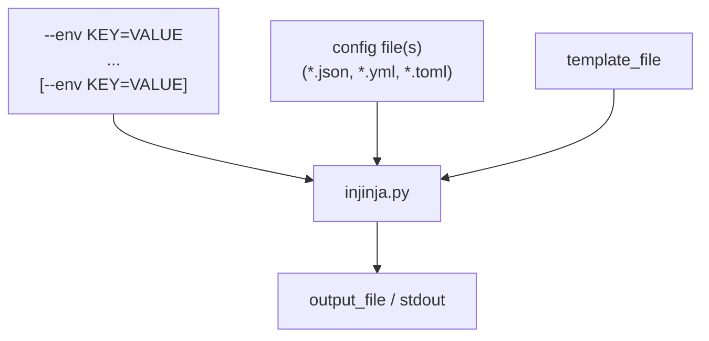

# injinja 🥷

Injinja: Injectable Jinja Configuration tool. Insanely configurable config system.

## Overview

Inspired by my prior work [invoke_databricks_wheel_tasks](https://github.com/neozenith/invoke-databricks-wheel-tasks/blob/main/invoke_databricks_wheel_tasks/tasks.py#L81)

This setup allows for configuration driven code based akin to Kubernetes etc but you define your own conventions as well as inject environment variables at runtime. Blending static and dynamic aspects of configuration.



1. Literally **ANY** config schema in a file format YML, JSON or TOML can be treated as a _Jinja2 Template itself_.
    - This makes for **VERY** dynamic config.
1. Then that config **IS** the config provided for a target Jinja template.
1. This final template could be terraform, SQL, js, python or even more JSON or YAML.

Output defaults to `stdout` or an output file can be specified.

This allows some "ahead-of-time config" and some "just-in-time config" to all be injected into a final output.
Absence of the "just-in-time" config results in merely merging the config file into the template.

Templating variables and not providing a value will throw an error to ensure templating is correct at runtime.

## USAGE

```sh
USAGE: python3 injinja.py [--debug] [--template/-t TEMPLATE]  [--config/-c CONFIGFILE/GLOB] [--env KEY=VALUE] [--env KEY=VALUE] [--output OUTPUTFILE]
```

One liner:

```sh
curl -fsSL https://raw.githubusercontent.com/neozenith/python-onboarding-guide/refs/heads/main/scripts/injinja.py | sh -c "python3 - -t template.j2 -c config.yml -e home_dir=$HOME"
```

## TODO
- Add custom directives like !include for YAML parser inspired by:
https://github.com/littleK0i/SnowDDL/blob/master/snowddl/parser/_yaml.py
- Add merging of collections of JSON or YAML if a pathspec is given
https://deepmerge.readthedocs.io/en/latest/index.html