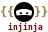

# injinja 🥷

<p align="center">
    
</p>
<p align="center">
    <!-- CICD / Publishing Health -->
    <a href="https://github.com/neozenith/injinja/actions/workflows/cicd.yml"></a>
    <a href="https://github.com/neozenith/injinja/actions/workflows/publish.yml"></a>
    <!-- coverage-badge -->
    
    <!-- coverage-badge -->
</p>
<p align="center">
    <!-- project development health -->
    <a href="https://github.com/neozenith/injinja/graphs/commit-activity"></a>
    <a href="https://github.com/neozenith/injinja/issues"></a>
    <a href="https://github.com/neozenith/injinja/pulls"></a>
</p>
<p align="center">
    <!-- License and latest info -->
    <a href="https://neozenith.github.io/injinja"></a>
    <a href="https://github.com/neozenith/injinja/blob/main/LICENSE"></a>
    <a href="https://github.com/neozenith/injinja/releases"></a>
</p>

<p align="center">Injinja: <b>Inj</b>ectable <b>Jinja</b> Configuration tool.</p>
<p align="center"><i>Insanely configurable... config system.</i></p>

<!-- TODO: Animated GIF demoing features. 800px wide -->

## Features

- **Recursive Deep Merge:** Sick of scrolling giant mega config files? Would you rather have organised folders of smaller configs that act like they are part of the same big config? We recursively deep merge your config.
- **Powerful:** Any of your config files are now empowered with the full programming capabilities of [`Jinja`](https://jinja.palletsprojects.com/en/stable/) templating engine for better parametrising the one set of config files.
- **Flexible:** You design your configuration schema yourself in any of JSON, YAML or TOML.
- **Enabling:** Separate your project config out to allow _"Drive By Contributors"_. Even non-technical colleagues can edit a text file in a browser to raise a PR.
- **Nothing Implicit:** By design nothing is implicit and every input is explicit. We prefer powerful tools rather than "magic" tools.

----

## Quickstart

```sh
uvx injinja -e home_dir="$HOME" -c 'samples/config/*' -t sql/ddl/warehouse__roles.sql.j2
# OR
uv run injinja.py -e home_dir="$HOME" -c 'samples/config/*' -t sql/ddl/warehouse__roles.sql.j2
```

Two step templating configuration system:

- Runtime `DYNAMIC` configuration (`-e` or `--env`)
- Can template the `STATIC` configuration (`-c` or `--config`)
- To allow deep and rich config to populate your `TEMPLATE` file (`-t` or `--template`).

----

## Simplified Architecture


1. **Dynamic Configuration**: Environment variables and CLI flags provide runtime values
2. **Static Configuration**: YAML/JSON/TOML files that can themselves be Jinja templates
3. **Schema Validation**: Validate merged configuration against schemas before templating
4. **Template Rendering**: Apply the validated configuration to your target template

----

## Documentation

Please read our [User Guide Documentation](https://neozenith.github.io/injinja)

## Roadmap and TODO list

[Open Issues that are raised by `neozenith`](https://github.com/neozenith/injinja/issues?q=is%3Aissue%20state%3Aopen%20author%3Aneozenith)
