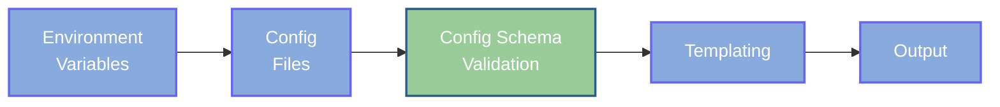

# Schema Validation

Injinja supports schema validation to ensure your final merged configuration meets specific requirements before templating. This catches configuration errors early with clear, actionable feedback.

Your `Jinja` templates are always run as `StrictUndefined` already. Missing variables because of your template will already throw validation errors. So if you make a typo in your configuration, the template won't find the value and won't template.

The Config Schema Validation adds extra rigour to validate your config BEFORE the final templating stage. This also llows you to use a variety of models to validate subsection of complex config hierarchies.

## Overview

Schema validation occurs **after** all configuration merging but **before** template rendering:



This ensures your configuration is valid before any templating begins, preventing failures downstream.

## Validation Approaches

Injinja supports two validation approaches:

1. **JSON Schema** - Industry-standard declarative validation
2. **Pydantic Models** - Python-native validation with type safety

Both approaches are unified under a single `--schema` flag with automatic detection.

## Quick Start

```bash
# Pydantic model validation  
injinja --schema models.py::ConfigModel -c config.yaml -t template.yml

# JSON Schema validation
injinja --schema schema.json -c config.yaml -t template.yml
```

## Pydantic Model Validation

Pydantic provides Python-native validation with full type safety and custom validation logic.

The following examples are also available in the [`examples/schema-validation/`](https://github.com/neozenith/injinja/tree/main/examples/schema-validation) folder on the github repo.

### Creating Models

Create a Python file with Pydantic model definitions:

**`models.py`:**

```python
from typing import Literal
from pydantic import BaseModel, Field, field_validator

class AppConfig(BaseModel):
    """Application configuration."""
    name: str = Field(..., min_length=1)
    version: str = Field(..., pattern=r'^\d+\.\d+\.\d+$')
    environment: Literal['development', 'staging', 'production']

class DatabaseConfig(BaseModel):
    """Database configuration."""
    host: str = Field(..., min_length=1)
    port: int = Field(..., ge=1, le=65535)
    name: str = Field(..., min_length=1)

class ConfigModel(BaseModel):
    """Main configuration model."""
    app: AppConfig
    database: DatabaseConfig
```

### Pydantic Model Usage

```bash
injinja \
  -e env_name=production \
  -c config.yaml \
  -t template.yml \
  --schema models.py::ConfigModel
```

### Pydantic Model Error Example

Pydantic provides structured error messages with field paths:

```text
ERROR:root:Pydantic validation failed:
  Model: models.py::ConfigModel
    Error at path: app -> version
    Message: String should match pattern '^\d+\.\d+\.\d+$'
    Input value: 1.2.3-beta

    Error at path: database -> port
    Message: Input should be less than or equal to 65535
    Input value: 70000
```

### Advanced Models

Create different validation rules for different environments:

```python
class ProductionConfigModel(BaseModel):
    """Strict configuration for production environments."""
    app: AppConfig
    database: DatabaseConfig

    @field_validator('database')
    def validate_production_database(cls, v):
        if v.host == 'localhost':
            raise ValueError('Production database cannot use localhost')
        return v

class StrictConfigModel(BaseModel):
    """Strict model that forbids extra fields."""
    app: AppConfig
    database: DatabaseConfig

    class Config:
        extra = "forbid"  # Reject unknown fields
```

Usage:

```bash
# Development - permissive validation
injinja --schema models.py::ConfigModel -c config.yaml -t template.yml

# Production - strict validation  
injinja --schema models.py::ProductionConfigModel -c config.yaml -t template.yml
```

## JSON Schema Validation

JSON Schema provides language-agnostic, declarative validation rules.

### Creating a Schema

Create a JSON Schema file defining your configuration structure:

**`schema.json`:**

```json
{
  "$schema": "http://json-schema.org/draft-07/schema#",
  "type": "object",
  "required": ["app", "database"],
  "properties": {
    "app": {
      "type": "object",
      "required": ["name", "version", "environment"],
      "properties": {
        "name": { "type": "string", "minLength": 1 },
        "version": { 
          "type": "string", 
          "pattern": "^\\d+\\.\\d+\\.\\d+$",
          "description": "Semantic version format (e.g., 1.2.3)"
        },
        "environment": {
          "type": "string",
          "enum": ["development", "staging", "production"]
        }
      }
    },
    "database": {
      "type": "object",
      "required": ["host", "port", "name"],
      "properties": {
        "host": { "type": "string", "minLength": 1 },
        "port": { "type": "integer", "minimum": 1, "maximum": 65535 },
        "name": { "type": "string", "minLength": 1 }
      }
    }
  }
}
```

### JSON Schema Usage

```bash
injinja \
  -e env_name=production \
  -c config.yaml \
  -t template.yml \
  --schema schema.json
```

### JSON Schema Error Example

For invalid configurations, JSON Schema provides detailed error messages:

```text
ERROR:root:Schema validation failed:
  Error at path: app -> version
  Message: '1.2' does not match '^\\d+\\.\\d+\\.\\d+$'
  Expected: ^\d+\.\d+\.\d+$
  Actual value: 1.2
  Full validation context:
  Schema rule: pattern = ^\d+\.\d+\.\d+$
```

### File Formats

JSON Schema files support multiple formats:

- `.json` - JSON format
- `.yaml`, `.yml` - YAML format  
- `.toml` - TOML format

All formats are loaded and parsed as JSON Schema definitions.

## Choosing an Approach

### Use JSON Schema When

- You want language-agnostic validation
- Working with external teams/tools that need schema docs
- Need complex pattern matching or conditional validation
- Prefer declarative schema definition
- Want maximum portability

### Use Pydantic When

- Working in a Python-centric environment
- Want type safety and IDE support
- Need custom validation logic
- Prefer object-oriented schema definition
- Want to reuse models in application code

## Error Handling

Both approaches provide detailed, actionable error messages:

- **Clear field paths** showing exactly where validation failed
- **Specific error messages** explaining what went wrong  
- **Expected vs actual values** for easy debugging
- **Schema context** showing which rule was violated

## Integration with CI/CD

Schema validation is perfect for CI/CD pipelines:

```bash
# Validate configurations before deployment
injinja \
  -c 'configs/prod/*.yml' \
  --schema schemas/production.json \
```

This catches configuration errors early, preventing deployment failures.

## Best Practices

### 1. Start Simple

Begin with basic required field validation:

```json
{
  "type": "object",
  "required": ["app", "database"],
  "properties": {
    "app": { "type": "object" },
    "database": { "type": "object" }
  }
}
```

### 2. Add Gradually

Introduce more validation rules as needs grow:

```json
{
  "properties": {
    "app": {
      "properties": {
        "version": { "pattern": "^\\d+\\.\\d+\\.\\d+$" }
      }
    }
  }
}
```

### 3. Test Both Paths

Verify both valid and invalid configurations work as expected:

```bash
# Test valid config
injinja --schema schema.json -c valid-config.yaml -t template.yml

# Test invalid config (should fail)
injinja --schema schema.json -c invalid-config.yaml -t template.yml
```

### 4. Document Schemas

Add descriptions and examples to schemas:

```json
{
  "properties": {
    "app": {
      "properties": {
        "version": {
          "pattern": "^\\d+\\.\\d+\\.\\d+$",
          "description": "Semantic version format (e.g., 1.2.3)"
        }
      }
    }
  }
}
```

### 5. Environment-Specific Validation

Consider different validation rules for different environments:

```bash
# Development - permissive
injinja --schema schemas/dev.json -c config.yaml -t template.yml

# Production - strict
injinja --schema schemas/prod.json -c config.yaml -t template.yml
```

## Debugging Configurations

Use the built-in config export to debug before validation:

```bash
# Export merged config to see what will be validated
injinja -c 'config/**/*.yml' -o config-json | jq '.'

# Then validate that exported config  
injinja -c 'config/**/*.yml' --schema schema.json -t template.yml
```

## Examples

For comprehensive examples including:

- Valid and invalid configuration scenarios
- Multiple Pydantic model types
- Error message examples
- Edge cases and troubleshooting

See the complete examples in the repository at `examples/schema-validation/`.

## Next Steps

- Explore [Advanced Usage](advanced.md) patterns
- Learn about [Configuration](configuration.md) best practices
- Check the [API Reference](../api/injinja.md) for programmatic usage
