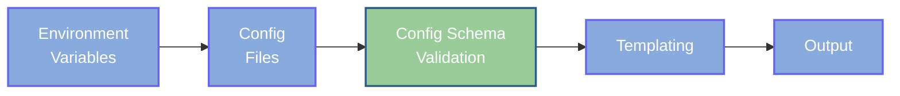

# Schema Validation with Injinja

Injinja now supports schema validation to ensure your final merged configuration meets specific requirements before templating. Two validation approaches are supported:

1. **JSON Schema** - Industry-standard schema validation
2. **Pydantic Models** - Python-native validation with type safety

## Quick Start

```bash
# JSON Schema validation
injinja \
-c config.yaml \
-t template.yml \
-s schema.json

# Pydantic model validation  
injinja \
-c config.yaml \
-t template.yml \
-s models.py::ConfigModel
```

## When Validation Occurs



Schema validation happens **after** all configuration merging but **before** template rendering:

1. Collect DYNAMIC config (environment variables)
2. Template and merge STATIC config files
3. **VALIDATE merged configuration against schema**
4. Apply final config to Jinja2 template

This ensures that your configuration is valid before any templating begins, catching errors early with clear feedback.

## Choosing an Approach

### Use JSON Schema When
- You want language-agnostic validation
- Working with external teams/tools that need schema docs
- Need complex pattern matching or conditional validation
- Prefer declarative schema definition
- Want maximum portability

### Use Pydantic When
- Working in a Python-centric environment
- Want type safety and IDE support
- Need custom validation logic
- Prefer object-oriented schema definition
- Want to reuse models in application code

## Error Handling Philosophy

Both approaches provide detailed, actionable error messages:

- **Clear field paths** showing exactly where validation failed
- **Specific error messages** explaining what went wrong  
- **Expected vs actual values** for easy debugging
- **Schema context** showing which rule was violated

## Examples

This directory contains complete examples for both approaches:

## Advanced Usage

### Multiple Validation Levels

You can create different validation rules for different environments all from the onedefinition file:

```bash
# Development - permissive validation
injinja \
    --schema models.py::DevConfigModel \
    -c config.yaml \
    -t template.yml

# Production - strict validation  
injinja \
    --schema models.py::ProductionConfigModel \
    -c config.yaml \
    -t template.yml
```

### Schema File Formats

JSON Schema files support multiple formats:
- `.json` - JSON format
- `.yaml`, `.yml` - YAML format
- `.toml` - TOML format

### Debugging Configurations

Use the built-in config export to debug before validation:

```bash
# Export merged config to see what will be validated
injinja \
    -c 'config/**/*.yml' \
    -o config-json | jq '.'

# Then validate that exported config  
injinja \
    -c 'config/**/*.yml' \
    --schema schema.json \
    -t template.yml
```

## Best Practices

1. **Start simple** - Begin with basic required field validation
2. **Add gradually** - Introduce more validation rules as needs grow
3. **Test both paths** - Verify both valid and invalid configurations
4. **Document schemas** - Add descriptions and examples to schemas
5. **Version control** - Keep schemas in version control with configs
6. **Environment-specific** - Consider different validation for dev/prod

## Integration with CI/CD

Schema validation is perfect for CI/CD pipelines:

```bash
# In CI: Validate configurations before deployment
injinja \
    -c 'configs/prod/*.yml' \
    --schema schemas/production.json
```

This catches configuration errors early, preventing deployment failures.
